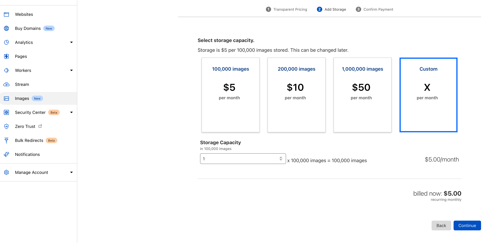

关于自建图床网络上已经有很多教程了，不同的方案对应不同的使用场景和优缺点。本系列记录下我个人的图床工作流。

如果不缺钱，一个月5美元可以直接上Cloudflare Images, 非常省心。

完整的[实现](https://twitter.com/cyanapps/status/1508403220544049156), 可以使用`JSBox`或`Taio`
[https://github.com/cyanzhong/Image-Uploader/blob/main/dist/image-uploader.zip](https://github.com/cyanzhong/Image-Uploader/blob/main/dist/image-uploader.zip)

[苹果生态下自建图床(2): Backblaze](/selfhostimage/backblaze)